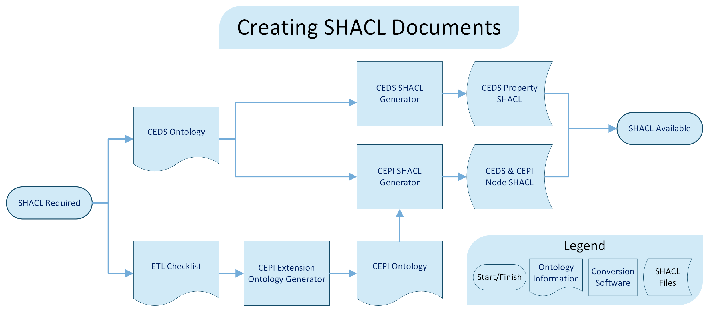

# CEDS/CEPI SHACL Shape Generator Tool

# Overview

This Python tool generates SHACL shape definitions from a list of RDF class and property identifiers. It is designed for use with the CEDS and Extension ontologies and outputs a filtered SHACL file.

# Input Requirements

The script expects a CSV input file containing Class IDs and Property IDs located in the ETL checklist in the following format:  
namespace:ClassID, namespace:PropertyID  
<br/>Each line defines a relationship between a class and a property. The script uses these relationships to build SHACL node and property shapes.

# Functionality

The script performs the following operations:

1. Logging Setup

- Configures a log file to track execution progress and errors.

2. Ontology Initialization

- Loads and parses CEDS and Extension ontology RDF and TTL files into an RDFLib graph.

3. CSV Parsing

- Reads the class-property mappings from the CSV and resolves each identifier to a full URI based on its namespace.

4. SHACL Graph Creation

- Builds a secondary RDF graph where SHACL NodeShapes and PropertyShapes are constructed based on the mappings and class hierarchy.

5. Shape Enrichment

- Adds SHACL-specific constraints such as ignored properties and property ranges. Where applicable, it references parent classes.

6. Output

- The final SHACL file is saved to a temporary location as 'Filtered_SHACL.ttl'.

# File Prompts

The script expects the following files when prompted:

\- Ontology file for the CEDS ontology.

\- Ontology file for the Extension ontology.

\- Input CSV with Class and Property mappings.

\- Extension Namespace

\- Extension Namespace abbreviation

# Output

The tool generates a SHACL file containing NodeShapes and PropertyShapes filtered by the given mappings. The file is saved to:

Filtered_SHACL.ttl

# Execution

The script can be run directly via command line:

python create_shacl.py


# Overarching Process
# Overview
This document serves as an entry point to users tasked with the creation of SHACL documents for the purpose of supporting CEPI data collection. This includes identifying the inputs, the outputs and the means for translating between the two. Additionally, an abbreviated background overview of major concepts is also provided.

# Workflow
As shown below, the path to generating SHACL file(s) that will ensure data are collected in a consistent and accurate manner requires several steps.



| Workflow Item                       | Description | Example / URL  |
|-------------------------------------|-------------|----------------|
| `CEDS Ontology`                     | The CEDS ontology is the logical definition of the CEDS data model in RDF XML format. It includes fundamental concepts like a Person with a Name, as well as specific elements like gender.    | [CEDS open-source community](https://github.com/CEDStandards/CEDS-Ontology), [Self-hosted version](https://dev.cepi.state.mi.us/Ontology/ceds-ontology.rdf) |
| `ETL Checklist`                     | Education authorities extend the CEDS data model by aligning fields from legacy systems to CEDS specifications. These extensions can be specified in an ETL checklist and translated to SHACL. | — |
| `CEDS SHACL Generator`              | A separate working group developed a PHP-based tool to translate CEDS ontology properties into the SHACL format.                                                                               | [CEDS SHACL Generator](https://github.com/opensalt/CEDS-shacl-generator) |
| `CEDS Property Shapes`               | Defines specific fields and option sets needed for a physical data model, translated from the CEDS ontology to SHACL format.                                                                   | [CEDS Property Shapes](https://github.com/CEDS-Collaborative-Exchange/CEDS-SHACL-JSON-LD-Framework/blob/develop/src/PropertyShapes.ttl) |

# Background
Data can be structured and moved in countless formats, but the JSON format has become one of the more popular options. Its relatively simple format (it is comprised of 6 primary data types) has facilitated widespread adoption within software and API development. There are, however, use cases such as the collection of administrative data that require the imposition of additional structure. This is where JSON for Linked Data, or JSON-LD, enters. JSON-LD allows the connection of JSON data to data model specifications. This data model allows for the definition of complex rulesets to govern the content of JSON-LD files. As should be expected, there are multiple standards available to define the data model that will govern JSON-LD content. The Shapes Constraint Language (SHACL) is particularly useful because it enables explicit data validation logic such as required fields or formats. 

> TLDR: Administrative data can be stored in the JSON-LD format. SHACL can be used to ensure data validity.

# Terminology
Storing data and validation logic in new formats introduces new terminology and new synonyms. Using the proposed terms, below, will facilitate improved communication.

| Proposed Term  | RDF XML Ontology    | SHACL Ontology                 | Database Analog  | Example              | Notes                                                                                                          |
|----------------|---------------------|--------------------------------|------------------|----------------------|----------------------------------------------------------------------------------------------------------------|
| Class          | rdfs:Class          | nodeShape                      | Table            | Organization         | Classes may have subclasses; almost all classes have a parent class.                                           |
| Property       | rdf:property        | propertyShape (Dates/Literals) | Field            | Organization Name    | Properties of base type (string, date/time, etc.)                                                              |
| Property       | rdf:property        | propertyShape (IRI)            | Foreign Key      | Organization Type    | Properties that point to a class (of type IRI/node)                                                            |
| Option Value   | owl:NamedIndividual | In Constraint                  | value choice     | K12School, LEA, etc. | Each value effectively defines one of the choices that would for instance appear in a dropdown control in a UI |


# Abridged Example

The fundamental starting point for building CEDS-compliant SHACL is, of course, the CEDS Ontology. The CEDS ontology is itself a data specification. It allows us to infer relationships between data elements (e.g., a person has a first name) but it doesn't enforce validation rules (e.g., a first name has a length limit). Although it doesn't follow the SHACL standard, it can be translated to SHACL programmatically and validations such as required fields can be amended to enhance the SHACL. Here's the representation of First Name in the CEDS ontology:

```
<rdf:Property rdf:about="http://ceds.ed.gov/terms#P000115">
	<dc:creator>Common Education Data Standards</dc:creator>
	<dc:identifier rdf:datatype="http://www.w3.org/2001/XMLSchema#token">P000115</dc:identifier>
	<rdfs:label>First Name</rdfs:label>
	<schema:domainIncludes rdf:resource="http://ceds.ed.gov/terms#C200377"/>
	<schema:rangeIncludes rdf:resource="http://www.w3.org/2001/XMLSchema#string"/>
	<skos:notation>FirstName</skos:notation>
</rdf:Property>
```
And here is First Name represented in the SHACL format with an included length constraint:

```
ceds:P000115Shape
  a sh:PropertyShape ;
  sh:path ceds:P000115;
  sh:name "First Name" ;
  sh:datatype xsd:normalizedString ;
  sh:maxLength 35 ; 
.
```
Given the above SHACL structure, a simplified version of a JSON-LD document for a person might take this form:

```json
{
    "@type": "Person",
    "@id": "http://cepi.michigan.gov/person/38330",
	
    "hasPersonName": {
        "@type": "PersonName",
        "FirstName": "Susan",
        "LastOrSurname": "Anthony"
    }
}
```
In this example the SHACL file uses a coded indicator for first name (P000115) whereas the JSON-LD file uses a descriptive indicator (FirstName). This increases the human-readability of the JSON-LD files but does require provision of a crosswalk for the terms. An intermediary "context" file is used to map elements of a JSON-LD file to the corresponding element in the SHACL document. While technically out-of-scope for this documentation, users can [access it online](https://dev.cepi.state.mi.us/Ontology/context.json). This context file is also in JSON format:

```json
{
    "@context": {
        "@base": "http://ceds.ed.gov/terms#",
        "rdf": "http://www.w3.org/1999/02/22-rdf-syntax-ns#",
        "ceds": "http://ceds.ed.gov/terms#",
        "FirstName": "P000115"
	}
}
```
